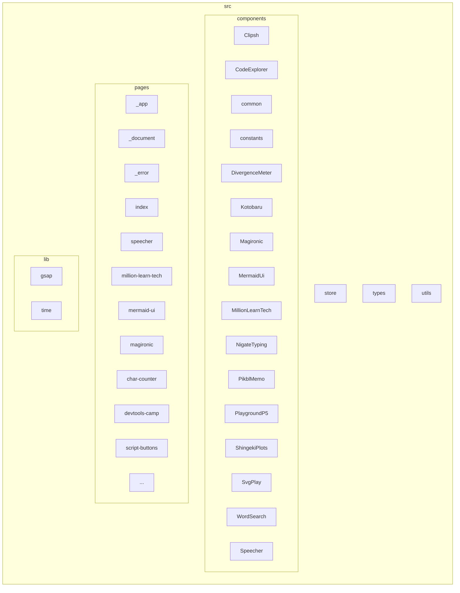

# アプリケーションドキュメント

## 概要

このアプリケーションは、React、TypeScript、Next.js を使用して構築された、複数の小さなツールと実験をまとめたものです。

## ディレクトリ構造

## 主要なコンポーネント

- `Layout`: ページ全体のレイアウトを提供します。
- `Title`: ページタイトルを表示します。
- `Speecher`: 音声認識と画像検索を行うツールです。
- `MillionLearnTech`: 特定の技術トピックを学習するためのリソースを提供します。
- `MermaidUi`: Mermaid 記法で記述されたグラフを React Flow に変換します。

## 各ツールの説明

### Speecher

音声認識を行い、認識されたテキストに基づいて画像検索を行います。

**入力:**

- 音声

**出力:**

- 認識されたテキスト
- 検索された画像のリスト

### MillionLearnTech

特定の技術トピックを学習するためのリソースを提供します。

**入力:**

- なし

**出力:**

- 学習リソース

### MermaidUi

Mermaid 記法で記述されたグラフを React Flow に変換します。

**入力:**

- Mermaid 記法で記述されたグラフ

**出力:**

- React Flow で表示可能なグラフ

## 今後の開発

- 新しいツールの追加
- 既存のツールの改善
- UI の改善
- パフォーマンスの改善

## アプリの追加手順

1.  `src/pages` ディレクトリに新しいページファイルを作成します (例: `src/pages/new-app.tsx`)。
2.  新しいページに必要なコンポーネントを `src/components` ディレクトリに作成します。
3.  必要なユーティリティ関数を `src/lib` または `src/utils` ディレクトリに作成します。
4.  新しいページで使用する外部ライブラリをインストールします (例: `npm install <library-name>`)。
5.  `src/components/Menu.tsx` を編集し、新しいページへのリンクを追加します。
6.  開発サーバーを起動し、新しいページが正しく表示されることを確認します (通常は `npm run dev` コマンドを使用し、ポートは 3010 です)。
